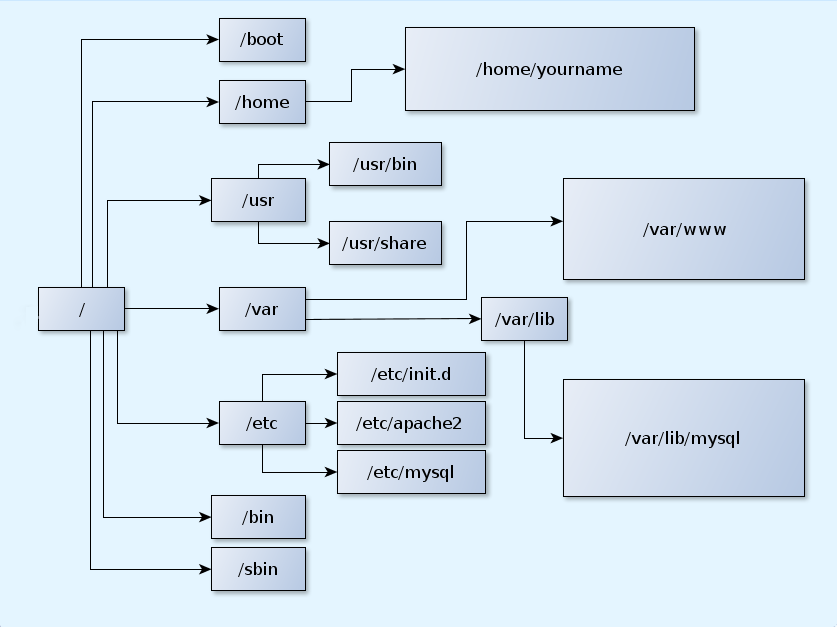

# github.com/hachepunto/bioinformatica-fisica-biomedica
### TEMAS SELECTOS DE FÍSICA DEL DIAGNOSTICO MÉDICO 

## Interfaz de línea de comandos

La **[Interface de línea de comandos](http://en.wikipedia.org/wiki/Command-line_interface)** (CLI) es un **método para interactuar** con un programa o sistema operativo de computadora que permite al usuario dar órdenes al programa **en forma de líneas de texto** sucesivas (líneas de comando). 

La **CLI** es menos usada por el usuario de computadoras promedio que prefiere usar una **[Interfaz Gráfica de Usuario](http://en.wikipedia.org/wiki/Command-line_interface)** (GUI) que ofrece una estética mejorada y una mayor simplificación, a costa de un mayor consumo de recursos computacionales, y, en general, de una reducción de la funcionalidad alcanzable.

La **CLI**, sin embargo, es preferida por los usuarios avanzados de cómputo dado que ofrece medios más concisos y poderosos para controlar programas o sistemas operativos.

**Bash** ([Bourne Again SHell](https://www.gnu.org/software/bash/)) es un intérprete de comandos para sistemas tipo Unix (Linux, macOS, etc.). Te permite escribir y ejecutar órdenes para interactuar con el sistema operativo.

## Prompt

Caracter o caracteres que se muestran en la linea de comandos para indicar que está listo para recibir tus órdenes.

#### UNIX/GNU/Linux
```
usuario@máquina:~$
```

#### Mac OS X
```
máquina:~ usuario$
```

#### R
```
>
```

#### Python
```
>>>
```

## Navegación de Directorios

    Comando: pwd
    Qué hace: Muestra la ruta del directorio actual (Print Working Directory).
    Salida esperada: algo como /home/tu_usuario.

    Comando: ls
    Qué hace: Lista los archivos y carpetas del directorio.

    ls -l: muestra detalles como permisos y dueño.
    ls -a: muestra archivos ocultos.

    Comando: cd
    Qué hace: Cambia de directorio (Change Directory).

    Comando: touch
    Qué hace: Crea un archivo vacío o actualiza la fecha de modificación.
    Ejemplo: touch mi_archivo.txt

    Comando: mkdir
    Qué hace: Crea directorios (Make Directory).
    mkdir mi_carpeta
    mkdir -p carpeta/padre/hija
    * -p: crea toda la estructura de directorios si no existe.

    Comando: cp
    Qué hace: Copia archivos o carpetas.
    cp mi_archivo.txt copia_archivo.txt
    cp -r mi_carpeta mi_carpeta_backup
    * -r: copia recursiva para carpetas.

    Comando: mv
    Qué hace: Mueve o renombra archivos y carpetas (Move).
    mv mi_archivo.txt otra_carpeta/
    mv archivo_viejo.txt archivo_nuevo.txt

    Comando: rm
    Qué hace: Elimina archivos o carpetas.
    rm mi_archivo.txt
    rm -r mi_carpeta

    Comando: man
    Qué hace: Muestra el manual del comando seleccionado.
    man ls
    man mkdir

### Estructura de archivos

En los sistemas UNIX los archivos están organizados por directorios. Los directorios son archivos especiales que contienen información que permite localizar otros archivos en los dispositivos de almacenamiento. Los directorios pueden contener a su vez otros directorios los cuales se denominan subdirectorios. A la estructura resultante de esta organización se le conoce como *estructura de árbol invertido*.



   - Directorio raíz o *root* `/`: Es aquel directorio que está sobre todos los directorios. 

```
ls /
```
   
   - Directorio de conexion `~`:  Es un directorio especial que representa el directorio principal del usuario (home). 

En estos comandos vamos a cambiarnos a la raíz de nuestro sistema de archivos y desde ahí vamos a usar `~` para "ver" que hay dentro de nuestra *home*

Notén que, es el *home* de nuestro usuario con el que entramos al servidor, no cualquier *home*.

```
ls ~
cd ~
```

   - Directorio de trabajo `.`: El punto representa el directorio en el que estamos parados

```
ls .
```

   - Directorio superior `..`: Dos puntos representa el directorio arriba del que estamos parados

```
ls ..
cd ..
```

  - Listado en formato largo con `ls -l`:


  - Permisos de archivos

  

### Salida estandar

La salida estandar (_Standar output_ o _stdout_) se refiere al _flujo estandarizado_ de datos que produce un programa de linea de comandos. Este flujo de datos, el cual es texto plano, facilita la exportación a diferentes dispositivos como impresoras, monitores o bien otros programas. 


## Redirección de la salida estandar

>: Redirige la salida a un archivo (sobrescribe)

```
echo "Hola mundo" > archivo.txt
```

>>: Redirige la salida a un archivo, pero agrega al final

```
echo "Otra línea" >> archivo.txt
```

<: Usa un archivo como entrada de un comando

```
sort < archivo.txt
```

## Pipes

Para redirigir la salida de un programa a otro se usa **|**  ( **pipe** o tubería ). Este es un método para encadenar programas de tal modo que la salida de uno es la entrada del que sigue. Se usa una barra vertical para separar los programas a usar.


```
ls -l | grep "carpeta"
```

### Comandos comunes de bash

| Comando | Descripción                                                   | Ejemplo                          |
|---------|---------------------------------------------------------------|----------------------------------|
| pwd     | Imprime el directorio de trabajo actual.                      | ```pwd```                              |
| ls      | Lista archivos y directorios en el directorio actual.         | ```ls -la```                           |
| cd      | Cambia al directorio especificado.                            | ```cd /home/user```                    |
| mkdir   | Crea un nuevo directorio.                                     | ```mkdir nuevo_directorio```           |
| rm      | Elimina archivos o directorios.                               | ```rm archivo.txt```                   |
| cp      | Copia archivos o directorios.                                 | ```cp archivo.txt copia_archivo.txt``` |
| mv      | Mueve o renombra archivos o directorios.                      | ```mv archivo.txt nueva_ubicacion/```  |
| cat     | Concatena y muestra el contenido de archivos.                 | ```cat archivo.txt```                  |
| echo    | Muestra una línea de texto o variables.                       | ```echo "Hola, mundo!```               |
| chmod   | Cambia los permisos de archivos o directorios.                | ```chmod 755 script.sh```              |
| grep    | Busca patrones en archivos utilizando expresiones regulares.  | ```grep "cadena" archivo.txt```        |
| find    | Busca archivos y directorios bajo un directorio.              | ```find /home/user -name "*.txt@```    |
| head    | Muestra las primeras líneas de un archivo.                    | ```head -n 10 archivo.txt```           |
| tail    | Muestra las últimas líneas de un archivo.                     | ```tail -n 10 archivo.txt```           |
| wc      | Cuenta líneas, palabras y caracteres en archivos.             | ```wc -l archivo.txt```                |

### Descarga de archivo de la web

```
wget "https://raw.githubusercontent.com/hachepunto/bioinformatica-fisica-biomedica/master/data/Characters.tsv"
```

### Visualizar el archivo

```
less Characters.tsv
```

salir con q

```
more Characters.tsv
```

#### Buscar todos los personajes de la casa Griffindor 

```
grep Gryffindor Characters.tsv
```

#### Coincidencias parciales

```
grep dor Characters.tsv
```

opciones comunes c, e, F, i, m y v

#### Filtrado de condiciones especificas

```
grep "Gryffindor" Characters.tsv | grep -F "Pure-blood" | grep -i "black"
```

## Preprocesamiento de datos de secuenciación

### Análisis con fastqc

```
wget https://zenodo.org/records/3736457/files/1_control_18S_2019_minq7.fastq
```

```
mkdir fastqc
fastqc -o fastqc/ control_18S_2019_minq7.fastq
```

### Recorte de adaptadores y lecturas de mala calidad

```
mkdir datos_clase
```

Deacargen los archivos fastq de:

https://drive.google.com/drive/folders/1MakE3A3VHXSmpw3fz66LveVMYWHxhBjW?usp=sharing

Colocar en la carpeta creada


```
cd datos_clase
fastp --in1 sub_SRR10212258_R1.fastq.gz --in2 sub_SRR10212258_R2.fastq.gz --out1 trimming/sub_SRR10212258_R1.trimmed.fq.gz --out2 trimming/sub_SRR10212258_R2.trimmed.fq.gz -g 10 -q 20 -l 50 --html trimming/SRR10212258_fastp.html --json trimming/SRR10212258_fastp.json
```

### indice de kallisto 

```
wget https://ftp.ensembl.org/pub/release-113/fasta/homo_sapiens/cdna/Homo_sapiens.GRCh38.cdna.all.fa.gz
kallisto index -i Homo_sapiens.GRCh38.idx Homo_sapiens.GRCh38.cdna.all.fa.gz
```

##### pseudo mapeo de kallisto 

```
kallisto quant -i ref/Homo_sapiens.GRCh38.idx -o ${sample} ${R1} ${R2} 2> ${sample}_kallisto.log
```

#### Modificar comando de Fastp

```
fastp --in1 data/sub_SRR10212259_R1.fastq --in2 data/sub_SRR10212259_R2.fastq --out1 trimming/sub_SRR10212259_R1.trimmed.fq.gz --out2 trimming/sub_SRR10212259_R2.trimmed.fq.gz -g 10 -q 20 -l 50 --html trimming/SRR10212259_fastp.html --json trimming/SRR10212259_fastp.json
```

### Calidad 

fastqc -o fastqc -f fastq -q sub_SRR10212259_R1.fastq sub_SRR10212259_R2.fastq
fastqc -o fastqc -f fastq -q trimming/sub_SRR10212259_R1.trimmed.fq.gz trimming/sub_SRR10212259_R2.trimmed.fq.gz

#### Kallisto 

```
mkdir kallisto_quants
```

```
kallisto quant -i ref/Homo_sapiens.GRCh38.idx -o kallisto_quants/SRR10212259 trimming/sub_SRR10212259_R1.trimmed.fq.gz trimming/sub_SRR10212259_R2.trimmed.fq.gz 2> kallisto_quants/SRR10212259/sub_SRR10212259_kallisto.log

kallisto quant -i ref/Homo_sapiens.GRCh38.idx -o kallisto_quants/SRR10212259 trimming/sub_SRR10212259_R1.trimmed.fq.gz trimming/sub_SRR10212259_R2.trimmed.fq.gz 2> SRR10212259_kallisto.log

kallisto quant -i ref/Homo_sapiens.GRCh38.idx -o kallisto_quants/SRR10212258 trimming/sub_SRR10212258_R1.trimmed.fq.gz trimming/sub_SRR10212258_R2.trimmed.fq.gz 2> kallisto_quants/SRR10212258/sub_SRR10212258_kallisto.log
```

